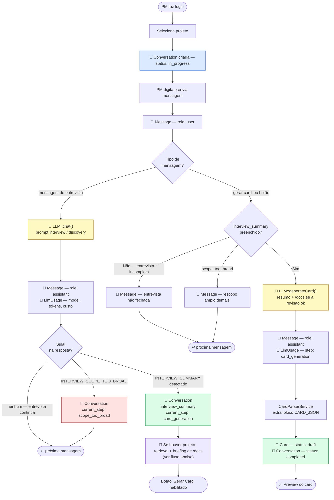
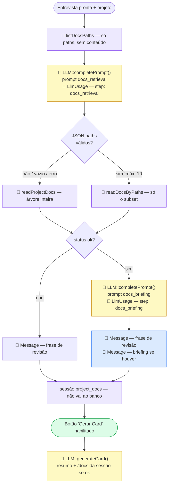
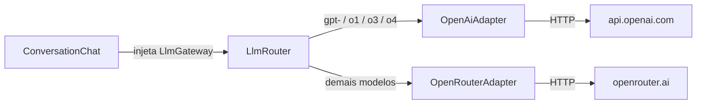

# PM Helper

Assistente de discovery para Product Managers. Conduz uma entrevista guiada pelo framework do time e gera um card estruturado ao final.

A ideia do produto é absorver no aplicativo as etapas de **qualificação** (`problem-qualify`) e **discovery** da [metodologia em evolução](https://github.com/Fredrumond/skills-metodologia) — o restante do ciclo (plano, ADR, code review, handoff) permanece nas skills do Cursor.

**Versão atual:** 0.7.1

---

## Fluxo completo — do início ao card

> 💾 persiste no banco · 🤖 chama a LLM · 📂 lê `/docs` (MCP)



---

## Fluxo de `/docs` — retrieval e briefing

Disparado só no encerramento da entrevista, quando há projeto selecionado. Orquestrado pelo `DocsRetrievalService`. Sem projeto, este bloco não roda.

> 💾 persiste no banco · 🤖 chama a LLM · 📂 lê `/docs` (MCP)



- **Retrieval** (`docs_retrieval@v1`): recebe o índice de paths + o `interview_summary`; devolve JSON `{"paths": [...]}`. Paths inventados ou fora de `/docs` são descartados. Falha, lista vazia ou parse inválido volta ao dump completo.
- **Briefing** (`docs_briefing@v1`): só com status `ok`. Cruza o conteúdo lido com o resumo e gera texto livre em português (sobreposição, conflito, vocabulário). Falha ou vazio: só a frase de revisão, sem erro na UI.
- O teto `GITHUB_MCP_MAX_CHARS` vale sobre o conteúdo **já filtrado**, não sobre a árvore inteira.
- `generateCard` não relê o GitHub: usa o payload da sessão.

---

## Arquitetura LLM

As chamadas de IA passam pelo contrato `LlmGateway`. O `LlmRouter` escolhe o adapter pelo prefixo do modelo:



- **OpenRouter** (padrão, obrigatório): `OPENROUTER_API_KEY` · modelo em `OPENROUTER_MODEL`
- Fallback automático em rate limit ou resposta vazia: `OPENROUTER_FALLBACK_MODELS`
- **OpenAI** (opcional): `OPENAI_API_KEY` · modelo em `OPENAI_MODEL` (padrão `gpt-4o-mini`)
- Sem `OPENAI_API_KEY`, ids nativos como `gpt-4o-mini` caem no OpenRouter e tendem a falhar (slug correto seria `openai/gpt-4o-mini`)
- Custo: a OpenRouter manda `usage.cost`; a OpenAI não — nesse caso o `LlmUsage` estima pela tabela em `config/llm.php`. Sem entrada na tabela o custo fica `0` e as métricas mentem

Decisões de arquitetura: `docs/adr/` (0001 ports & adapters, 0002 prefixo nativo OpenAI, 0003 tabela de preços, 0004 MCP GitHub, 0005 retrieval versionado de `/docs`).

---

## Prompts e passos da entrevista

| Passo | Prompt | O que faz |
|-------|--------|-----------|
| `interview` / `discovery` | `resources/prompts/interview/v*.md` | Conduz a entrevista (Objetivo · Como funciona hoje · Regras · Onde · Aceite · O que não fazer · Stakeholders · Como validar) |
| `docs_retrieval` | `resources/prompts/docs_retrieval/v*.md` | Escolhe até 10 paths de `/docs` a partir do índice + resumo |
| `docs_briefing` | `resources/prompts/docs_briefing/v*.md` | Humaniza o cruzamento `/docs` × entrevista na conversa |
| `card_generation` | `resources/prompts/card_generation/v*.md` | Monta o JSON do card a partir do `interview_summary` (+ `/docs` se a revisão ok) |

Prompts são versionados (`v1`, `v2`, …). Novas versões nunca sobrescrevem as anteriores — registrar em `SystemPromptCatalog`.

---

## Modelos de dados relevantes

| Model | Tabela | Campos-chave |
|-------|--------|-------------|
| `Conversation` | `conversations` | `status`, `current_step`, `interview_summary`, `prompt_name`, `prompt_version` |
| `Message` | `messages` | `role` (user/assistant), `content` |
| `Card` | `cards` | `title`, `objetivo`, `regras`, `aceite`, `stakeholders`, `status` (draft/approved) |
| `LlmUsage` | `llm_usages` | `model`, `step`, `prompt_tokens`, `completion_tokens`, `cost`, `finish_reason` |
| `Project` | `projects` | `name`, `repository` (GitHub `owner/repo`), `branch` (ref da pasta `/docs`) |

---

## Stack

PHP 8.3 · Laravel 13 · Livewire 4 · Tailwind CSS + Vite · MySQL 8 · Docker · Laravel Breeze

---

## Setup

```bash
cp .env.example .env
# Preencha OPENROUTER_API_KEY (obrigatório para os modelos free)
# OPENAI_API_KEY é opcional — necessária apenas para ids gpt-*, o1*, o3*, o4*

docker compose up -d --build
docker compose exec app composer install
docker compose exec app php artisan key:generate
docker compose exec app php artisan migrate
```

Acesse [http://localhost:8080](http://localhost:8080).

PHP, Artisan e Composer **sempre** dentro do container: `docker compose exec app …`

```bash
docker compose exec app composer test   # roda PHPUnit
docker compose logs -f app              # logs em tempo real
```
