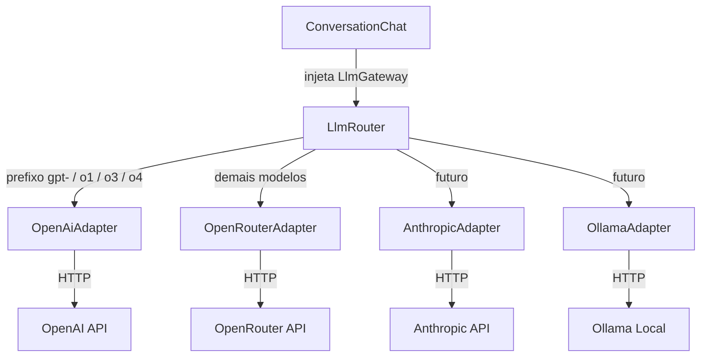

# PM Helper

Assistente de discovery para Product Managers. Conduz uma entrevista guiada e gera um card estruturado no framework do time.

**Versão atual:** 0.6.4 (development)

## LLM (OpenRouter + OpenAI)

As chamadas de IA passam pelo contrato `LlmGateway`. O `LlmRouter` escolhe o adapter pelo prefixo do modelo. O padrão continua sendo o [OpenRouter](https://openrouter.ai) (`OpenRouterAdapter`).



- **OpenRouter** (obrigatório para os modelos free do catálogo): `OPENROUTER_API_KEY` ([obter aqui](https://openrouter.ai/keys))
- Modelo padrão OpenRouter: `OPENROUTER_MODEL` (hoje `nvidia/nemotron-3-ultra-550b-a55b:free`)
- Fallback em rate limit (só OpenRouter): `OPENROUTER_FALLBACK_MODELS`
- **OpenAI** (opcional): `OPENAI_API_KEY` ([obter aqui](https://platform.openai.com/api-keys)) e `OPENAI_MODEL` (padrão `gpt-4o-mini`)
- Com a chave OpenAI, ids `gpt-*`, `o1*`, `o3*` e `o4*` vão direto para `api.openai.com`. Sem a chave, esses ids caem no OpenRouter e tendem a falhar (o slug da OpenRouter é `openai/gpt-4o-mini`, não `gpt-4o-mini`)
- Custo: a OpenRouter manda `usage.cost`; a OpenAI não. Nesse caso o `LlmUsage` estima pela tabela em `config/llm.php` (USD / 1M tokens). Sem entrada na tabela o custo fica 0 e as métricas mentem
- O PM escolhe o modelo no chat (`config/chat.php`)

Decisões de arquitetura: `docs/adr/` (0001 ports & adapters, 0002 prefixo nativo OpenAI, 0003 tabela de preços).

## Stack

PHP 8.3 · Laravel 13 · Livewire 4 · Tailwind + Vite · MySQL 8 · Docker · Laravel Breeze

## Fluxo

1. O PM descreve **um** card (não um épico).
2. O assistente entrevista nas fases do framework: objetivo, como funciona hoje, regras, onde, aceite, o que não fazer, stakeholders, como validar.
3. Escopo amplo demais → a entrevista trava; é preciso voltar com um card definido.
4. Ao encerrar, **Gerar Card** produz o JSON estruturado (`draft`).

## Setup

```bash
cp .env.example .env
# Preencha OPENROUTER_API_KEY (obrigatório para os modelos free)
# OPENAI_API_KEY é opcional — só necessária para GPT-4o Mini, GPT-4o, GPT-4.1 e o4 Mini

docker compose up -d --build
docker compose exec app composer install
docker compose exec app php artisan key:generate
docker compose exec app php artisan migrate
```

Acesse [http://localhost:8080](http://localhost:8080).

PHP, Artisan e Composer **sempre** no container: `docker compose exec app …`

```bash
docker compose exec app composer test
docker compose logs -f app
```

Histórico de entregas: `/versoes`. Métricas de consumo: `/metrics`.
