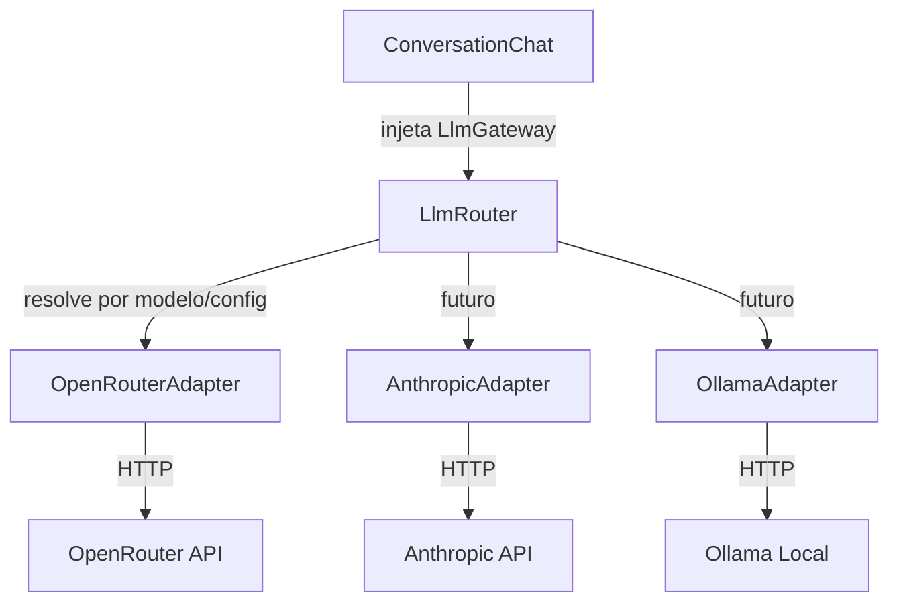

# PM Helper

Assistente de discovery para Product Managers. Conduz uma entrevista guiada e gera um card estruturado no framework do time.

**Versão atual:** 0.5.9 (development)

## LLM via OpenRouter

As chamadas de IA passam pelo contrato `LlmGateway`. O adapter padrão é o [OpenRouter](https://openrouter.ai) (`OpenRouterAdapter`); o `LlmRouter` escolhe o provedor pelo prefixo do modelo.



- Chave: `OPENROUTER_API_KEY` ([obter aqui](https://openrouter.ai/keys))
- Modelo padrão: `OPENROUTER_MODEL` (hoje `nvidia/nemotron-3-ultra-550b-a55b:free`)
- Fallback em rate limit: `OPENROUTER_FALLBACK_MODELS`
- O PM também escolhe o modelo no chat (`config/chat.php`)

## Stack

PHP 8.3 · Laravel 13 · Livewire 4 · Tailwind + Vite · MySQL 8 · Docker · Laravel Breeze

## Fluxo

1. O PM descreve **um** card (não um épico).
2. O assistente entrevista nas fases do framework: objetivo, como funciona hoje, regras, onde, aceite, o que não fazer, stakeholders, como validar.
3. Escopo amplo demais → a entrevista trava; é preciso voltar com um card definido.
4. Ao encerrar, **Gerar Card** produz o JSON estruturado (`draft`).

## Setup

```bash
cp .env.example .env
# Preencha OPENROUTER_API_KEY (obrigatório)

docker compose up -d --build
docker compose exec app composer install
docker compose exec app php artisan key:generate
docker compose exec app php artisan migrate
```

Acesse [http://localhost:8080](http://localhost:8080).

PHP, Artisan e Composer **sempre** no container: `docker compose exec app …`

```bash
docker compose exec app composer test
docker compose logs -f app
```

Histórico de entregas: `/versoes`. Métricas de consumo: `/metrics`.
