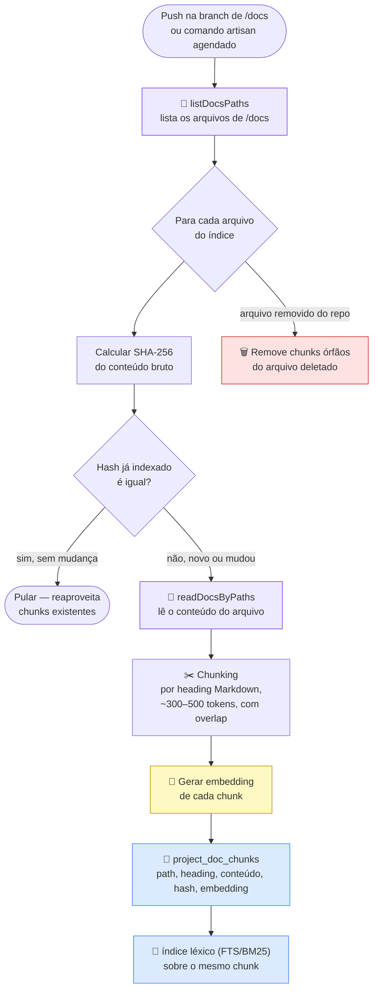
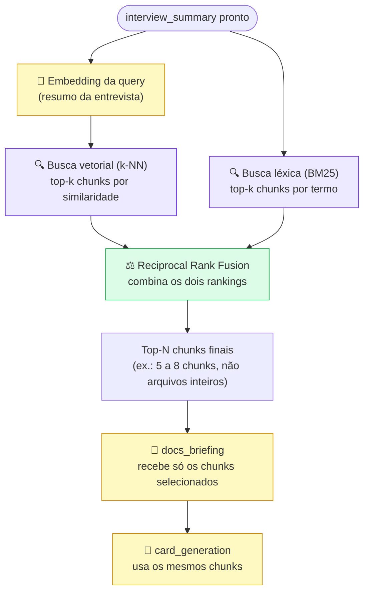
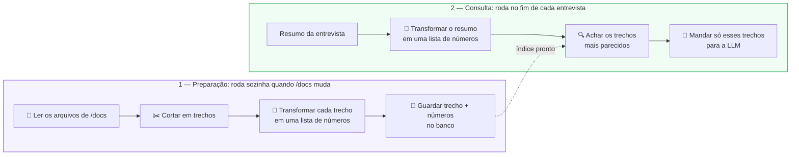
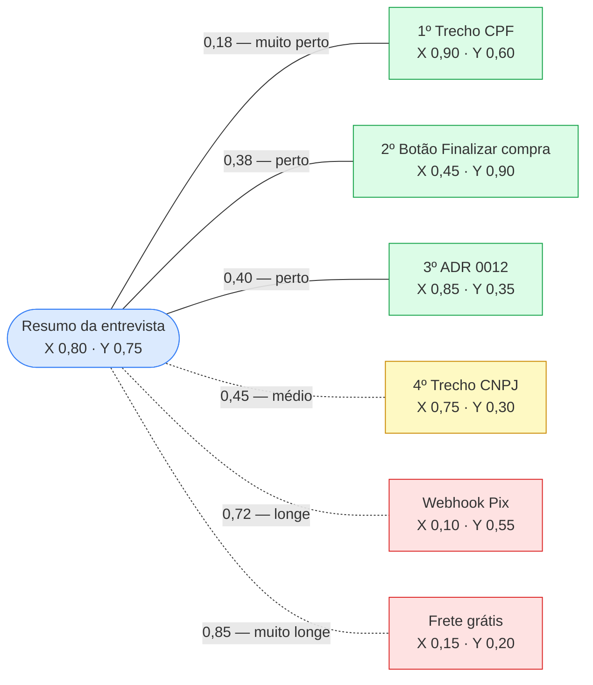
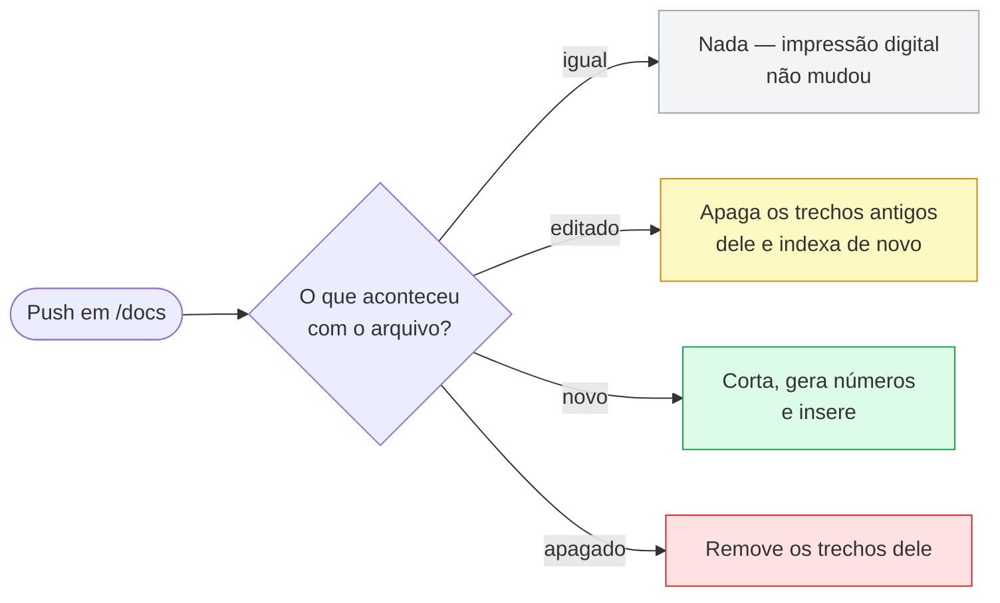
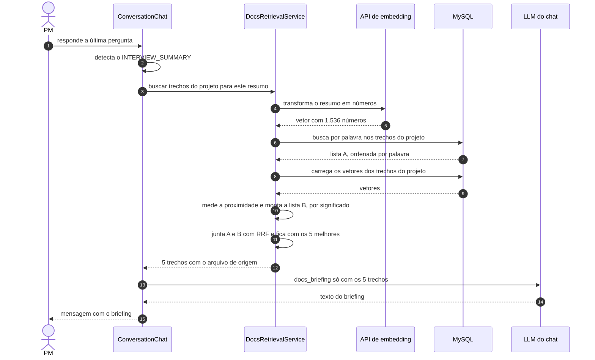
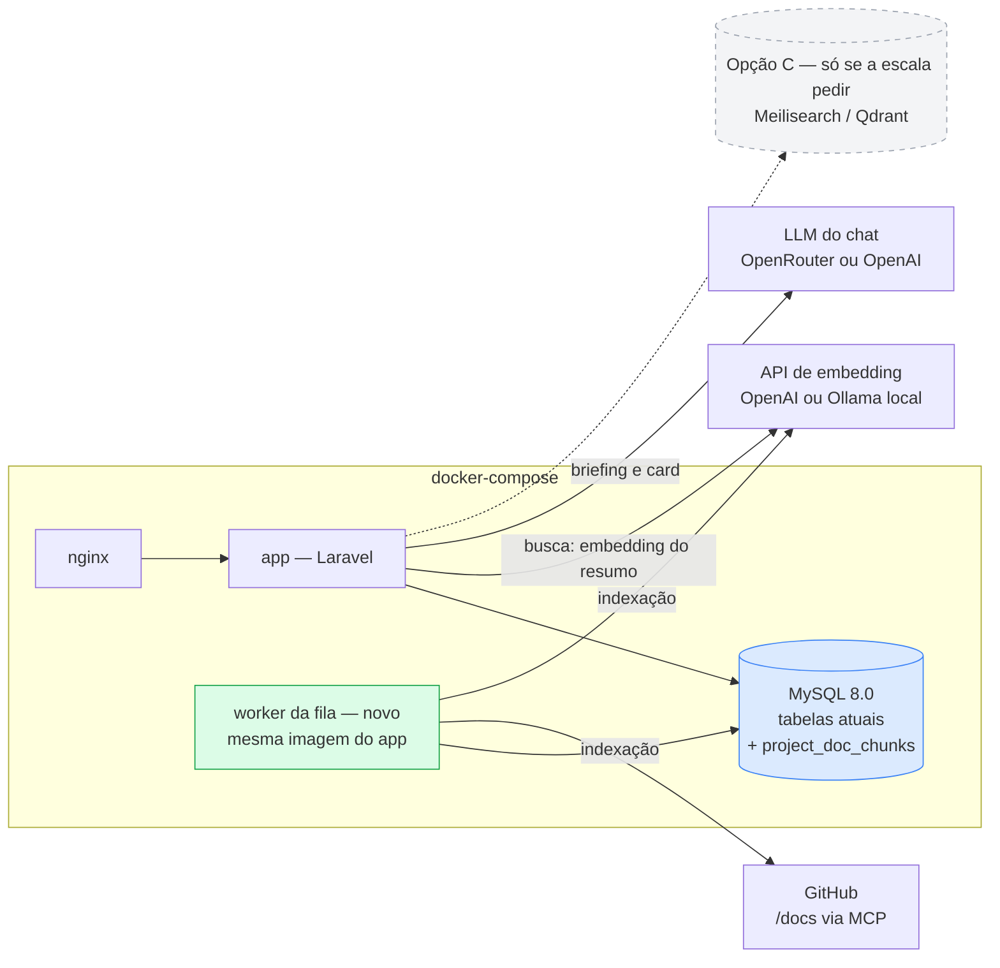

# PM Helper — Roteiro Pós-MVP

> **Base:** versão 0.8.0 (23/09/2026) · [`MVP_LAUNCH_GUIDE.md`](./MVP_LAUNCH_GUIDE.md)
> **Objetivo deste documento:** organizar, por trilha e prioridade, o que fica para depois do MVP — com atenção especial ao pipeline de contexto de projeto (`/docs`), hoje a etapa mais simples e mais cara do fluxo. As pendências que ainda entram no MVP estão na [seção própria](#pendencias-do-mvp); não misturam com as ondas da Trilha A.

---

## 1. Onde estamos (baseline honesto)

O MVP cobre qualificação de demanda (entrevista → resumo → card) com contexto opcional de `/docs`. Na 0.8.0 o admin passou a definir o modelo de cada prompt, o catálogo de LLM (lista, provedor e preço) vive no banco e as alterações administrativas são auditadas. Duas trilhas emergem do que já existe:

- **Trilha A — Produto/fluxo:** o que o launch guide marca como [fora do escopo do MVP](MVP_LAUNCH_GUIDE.md#-fora-do-escopo-do-mvp) (editar card, mencionar card, exportar, comentários, notificações, dashboard...).
- **Trilha B — Contexto de projeto (`/docs`):** o pipeline que lê o repositório para embasar o card. É o foco principal deste documento, porque:

### O que o pipeline de `/docs` faz hoje

1. `listDocsPaths` — lista só os caminhos de `/docs` via MCP GitHub.
2. `docs_retrieval@v1` — 1ª chamada LLM: escolhe até 10 arquivos relevantes a partir do resumo da entrevista.
3. `readDocsByPaths` — lê só o subset (teto `GITHUB_MCP_MAX_CHARS`, hoje 80k chars).
4. `docs_briefing@v2` — 2ª chamada LLM: gera o texto humanizado para o PM.
5. `card_generation@v3` — usa o conteúdo original de `/docs` (não o briefing) para gerar o card.

### Limitações conhecidas (ADR 0004, ADR 0005 e código)

| Limitação | Impacto |
|---|---|
| **2 chamadas LLM extras por entrevista** (retrieval + briefing), além da geração do card | Custo e latência somados ao fluxo principal, mesmo quando `/docs` é pequeno ou óbvio |
| **Depende de `/docs` existir e estar bem estruturado** no repositório | Projeto sem essa pasta (ou com docs fora dela) fica sem contexto — o card sai "cego" |
| **Sem cache** — cada entrevista relê e reprocessa tudo do zero | Repete custo mesmo se ninguém mudou nada em `/docs` desde a última conversa |
| **Fallback é o dump completo da árvore** | Em repositórios grandes, aborta por teto (`too_large`) em vez de degradar graciosamente |
| **Seleção de arquivos por prompt, não por relevância semântica real** | Escolhe arquivo inteiro ou nada; não existe busca por trecho/chunk |
| **"Alerta de demanda já coberta" depende só do que está em `/docs`** | Se a doc não existe ou está desatualizada, o PM Helper não percebe duplicidade — mesmo que o time já tenha gerado um card parecido dentro do próprio PM Helper |

Esses pontos são o motivo de existir uma trilha dedicada (Seção 3) em vez de só empilhar mais prompts.

---

## 1.1 Pendências do MVP

Não são feature nova. São correção do que o [`MVP_LAUNCH_GUIDE.md`](./MVP_LAUNCH_GUIDE.md) já promete (lista de conversas, métricas, projetos). Ficam fora das ondas da Trilha A. Detalhe da classificação: conversa vazia, exclusão lógica e reativar projeto entram no MVP; editar card e mencionar card ficam no pós-MVP.

| Item | Situação hoje | Solução | Por quê não espera o pós-MVP |
|---|---|---|---|
| **"Nova conversa" sem uso** | `ConversationController::store` grava a linha na hora. Cada clique vira um "Nova conversa" vazio | Reusar a conversa do PM que ainda não tem mensagem. Gravar só na primeira mensagem é melhoria posterior | Polui o passo 2 do launch guide |
| **Exclusão lógica de conversa** | `destroy` faz hard delete. `messages`, `cards` e `llm_usages` têm `cascadeOnDelete` | `SoftDeletes` em `Conversation`. Soft delete no Laravel não apaga filhos. Preview do card lê `conversation()` com `withTrashed()`. Sem tela de lixeira nesta entrega | Métricas e cards do MVP somem se o PM excluir a conversa |
| **Reativar projeto desativado** | Soft delete já existe; a tela só lista ativos e só tem **Desativar**. O `repository` único vale também para desativado | Bloco "Desativados" + **Reativar**. O teste do model já descreve restore em vez de duplicar | Admin que desativa por engano não recria o mesmo `owner/repo` e não vê o registro |

Editar card (rascunho ou aprovado) e mencionar um card no chat **não** entram aqui — são capacidade nova, nas ondas abaixo.

---

## 2. Como priorizar

Quatro critérios, nessa ordem:

1. **Não depender de pré-requisito que o projeto do PM não tem** (ex.: `/docs` bem escrita) — resolver isso é mais urgente que otimizar quem já tem.
2. **Reduzir custo/latência do que já roda em toda entrevista** antes de adicionar infraestrutura nova.
3. **Valor percebido pelo PM no dia a dia** (editar card, exportar) compete por prioridade com a trilha de contexto — não é "docs primeiro, resto depois", são ondas paralelas.
4. **Subir a indexação um degrau por vez, só com a dor à vista.** Entregar o 2a ou o 3a não abre o seguinte. Embedding, fila e motor de busca esperam o sintoma da [escada](#escada-da-indexação): paráfrase que o `FULLTEXT` errou, índice desatualizado, ou busca lenta na entrevista.

---

## 3. Trilha B — Evolução do contexto de projeto (`/docs`)

Inspirada em conceitos do [`my-memory`](https://github.com/FelipeMiiller/my-memory) (RAG híbrido, grafo de conhecimento, MCP nativo, indexação incremental), mas dimensionada para o estágio do PM Helper — sem replicar a infraestrutura pesada do projeto original (ver Seção 3.6).

### Fase 1a — Quick wins, sem infraestrutura nova

Resolve o caso "não tenho `/docs` documentado" e corta custo óbvio, sem tocar em arquitetura.

- **Fallback quando `/docs` não existe ou vem vazio:** ler `README.md` da raiz e, se existir, um `ARCHITECTURE.md`/`AGENTS.md` do repositório — trata como contexto "fraco" e avisa o PM que a documentação é limitada, em vez de silenciar.
- **Contexto manual colado pelo PM:** campo opcional no chat para colar um trecho de doc, ticket ou spec quando o repositório não tem nada — mesmo prompt de `card_generation`, sem depender do MCP.
- **Pular o `docs_retrieval` quando a árvore é pequena:** se `listDocsPaths` devolve poucos arquivos (ex.: ≤ 3), ler tudo direto e economizar a 1ª chamada LLM.
- **Cache por commit/branch:** guardar o resultado de `listDocsPaths` (e opcionalmente o conteúdo lido) por `repository@branch@commit_sha`, invalidando só quando o SHA muda. Evita reprocessar `/docs` a cada conversa nova do mesmo projeto.
- **Orçamento por tokens, não por caracteres:** trocar `GITHUB_MCP_MAX_CHARS` por um teto de tokens estimados, alinhado ao modelo em uso — hoje o teto é arbitrário em relação ao que a LLM realmente aceita.

**Esforço:** baixo · **Depende de:** nada novo · **Resolve:** custo repetido + projetos sem `/docs`.

### Fase 1b — Cascata de contexto quando nem `/docs` nem `README` bastam

Este é o buraco que sobra depois da Fase 1a: repositório sem `/docs`, com `README` vazio, genérico ou desatualizado. Simplesmente seguir "sem contexto" gera um card às cegas, sem sinalizar o risco. A resposta é uma escada de alternativas, da mais barata para a mais cara, aplicada nessa ordem antes de desistir:

1. **Nota de contexto persistente por projeto (não por conversa).** Hoje o `Project` só guarda nome, repositório e branch. Adicionar um campo de "contexto do produto" preenchido uma vez (pelo admin ou por qualquer PM) e reaproveitado em toda entrevista daquele projeto — resolve o retrabalho de colar o mesmo contexto manual (Fase 1a) a cada conversa nova.
2. **Fonte alternativa de docs fora do repositório de código.** Muitos times mantêm a spec em Notion, Confluence ou Google Docs — nunca em `/docs`. Generalizar o port `ProjectDocsGateway` para aceitar uma segunda implementação por projeto (link público, export `.md`, PDF colado); o `DocsRetrievalService` não muda de forma, só ganha uma fonte extra quando o GitHub vier vazio.
3. **Busca de código sob demanda, sem indexar nada.** Antes de desistir, buscar por palavras-chave do resumo da entrevista direto no repositório (code search do próprio MCP GitHub, ou `grep` via API), trazendo trechos de rotas/controllers com nomes parecidos. É busca literal e barata, que às vezes acha sinal suficiente para não gerar o card totalmente sem base. Embedding fica para os degraus 2b e 3b, e só se essa busca (ou o `FULLTEXT` dos degraus 2a/3a) não achar o que o PM precisa.
4. **Entrevista se adapta à ausência de contexto.** Quando nenhuma fonte de `/docs` está disponível — o que já se sabe antes da 1ª pergunta —, o prompt de `interview` passa a aprofundar deliberadamente a fase "Como funciona hoje" em vez de assumir que `/docs` vai preencher a lacuna depois. Hoje o prompt não distingue os dois cenários.
5. **Selo "gerado sem contexto de projeto verificado" no card.** Se nada acima resolver, o card sai marcado — na lista e no preview — avisando que ninguém confrontou o card com `/docs`, README, nota de projeto, fonte alternativa ou busca de código. O revisor humano sabe que precisa checar duplicidade e comportamento manualmente, em vez de confiar cegamente no card.

**Esforço:** médio (item 2 é o mais custoso; itens 1, 4 e 5 são baratos e podem entrar isolados) · **Depende de:** Fase 1a (README/ARCHITECTURE já resolve parte dos casos antes de chegar aqui) · **Resolve:** a lacuna real da pergunta "e se não tiver nada, nem `/docs` nem README suficiente?" — sem isso, o PM Helper hoje simplesmente segue sem avisar.

### Escada da indexação

Indexar é o passo em que o PM Helper passa a guardar trechos e consultá-los na entrevista, em vez de reler a fonte toda vez. A Fase 2 indexa o que o próprio PM Helper já gerou (cards e resumos). A Fase 3 indexa `/docs`. As duas sobem a mesma escada. **O 2a e o 3a são as portas de entrada, cada um com a sua dor. Embedding (2b, 3b), fila (3c) e motor dedicado (3d) só abrem Discovery quando o degrau de baixo, na mesma trilha, mostrar que não bastou.**

O contrato não muda entre degraus: uma tabela de trechos por projeto, o GitHub (ou o card salvo) continua sendo a fonte da verdade, e a busca filtra por `project_id` antes de ranquear. O embedding entra como coluna nessa mesma tabela. Fila e motor externo entram depois, sem trocar o que a tabela guarda.

| Degrau | O que se implementa | Dor que justifica | O que causa essa dor | Pode esperar enquanto |
|---|---|---|---|---|
| **2a** | `FULLTEXT` do MySQL em `interview_summary` e nos campos do `Card`, por projeto | O alerta de "demanda já coberta" não dispara, e o time só descobre a duplicata no refinamento | Já existem vários cards no mesmo projeto e `/docs` não menciona a demanda anterior — o histórico está no PM Helper, invisível para o fluxo | Poucos cards por projeto, e o PM ainda reconhece o histórico de cabeça |
| **2b** | Embedding desses mesmos cards, cosseno em PHP | A busca do 2a volta vazia (ou lixo) para uma demanda que o time já pediu | O card antigo e o resumo novo não compartilham palavras: "validar documento fiscal" contra "checar CPF" | O 2a acha as duplicatas que o PM esperava achar |
| **3a** | Chunk por heading `##` + `content_hash` + `FULLTEXT` sobre `/docs` | O retrieval custa caro em toda entrevista, o arquivo inteiro polui o briefing, ou o fluxo aborta por `too_large` | `/docs` cresceu: muitos arquivos, ou arquivos longos com várias seções, e a LLM escolhe o arquivo todo | A árvore cabe no atalho da Fase 1a (poucos arquivos) e o `docs_retrieval@v1` acerta o arquivo certo |
| **3b** | Coluna `embedding` na mesma tabela, RRF com o ranking do 3a | O briefing ignora a seção certa, e um `grep` manual no doc acha o assunto por outra palavra | O PM parafraseia: o resumo não repete o vocabulário de `/docs` | As palavras do resumo já aparecem na seção que deveria entrar |
| **3c** | Fila (`queue:work`), botão "Reindexar", depois agenda e webhook | O card cita trecho que já mudou no GitHub, ou arquivo novo nunca entra na busca | Ninguém reindexa, ou a indexação na requisição passa a travar a entrevista (docs grandes, ou a API de embedding do 3b) | O SHA muda pouco e um reindex manual (ou na primeira entrevista daquele SHA) ainda é instantâneo |
| **3d** | Meilisearch, Typesense ou Qdrant no lugar da busca em PHP | A busca é sentida na latência da entrevista | Milhares de trechos: muitos projetos ou `/docs` muito grande, e o cosseno em PHP sai da casa de décimos de segundo | A busca do 3b continua imperceptível ao lado da chamada de briefing |

Quem gera o embedding (OpenAI ou Ollama) e o ADR que autoriza persistir trecho de `/docs` no MySQL — hoje o [ADR 0004](adr/0004-ler-docs-via-mcp-github.md) mantém esse conteúdo só na sessão — entram junto com o **primeiro degrau que grava texto de `/docs` (3a)** ou que chama API de embedding (**2b** ou **3b**). O detalhe de custo, worker e privacidade está no [anexo](#7-anexo--indexação-explicada-do-zero).

### Fase 2 — Memória própria do PM Helper (independe do repositório ter `/docs`)

O PM Helper acumula conhecimento a partir do que ele mesmo já gerou. O alerta de "demanda já coberta" passa a considerar o histórico de cards do time, mesmo quando o repositório não tem `/docs`. Começa por busca de palavra nos dados que já estão no MySQL. Embedding é o degrau seguinte, se essa busca errar por vocabulário.

#### 2a — Busca por palavra nos cards e resumos

- Índice `FULLTEXT` em `interview_summary` e nos campos do `Card`, sempre filtrado por projeto.
- Antes de fechar o card, buscar cards e resumos do mesmo projeto com as palavras do resumo da entrevista.
- **Mencionar um card no chat:** o PM referencia um card existente do projeto durante a entrevista; o seletor reusa essa busca. Sem o 2a, não há de onde puxar o card com contexto.
- Nenhuma API nova, nenhuma tabela de vetor, nenhum worker.

**Implementar quando:** duplicata de card escapa e `/docs` não tinha como acusá-la — o sintoma aparece depois que o projeto acumula cards.
**Pode esperar enquanto:** o volume por projeto é baixo e o PM ainda vê a repetição na lista.
**Esforço:** baixo · **Depende de:** cards já salvos naquele projeto · **Resolve:** duplicidade óbvia, por palavra igual.

#### 2b — Busca por significado nos cards

- Mesmos registros do 2a ganham `embedding` e `embedding_model`.
- A entrevista gera o embedding do resumo e mede proximidade em PHP. O RRF junta esse ranking com o `FULLTEXT` do 2a.
- A chamada de embedding grava `LlmUsage` (step próprio, ex.: `card_indexing`) e preço em `config/llm.php`.

**Implementar quando:** o 2a não devolve o card antigo que o PM sabe que existe, porque as palavras não batem.
**Pode esperar enquanto:** o 2a cobre os casos reais de duplicata.
**Esforço:** médio · **Depende de:** 2a em uso, e a dor de paráfrase confirmada · **Resolve:** duplicata dita com outras palavras.

### Fase 3 — Indexação de `/docs` em degraus

Para quando `/docs` existe e o pipeline atual (LLM escolhe arquivos inteiros) deixa de ser suficiente. O destino, se todas as dores aparecerem, é o `memory_search` do my-memory: pedaços de texto, busca por palavra e por significado, combinadas por RRF, reindexando só o arquivo cujo `content_hash` mudou. A implementação começa bem antes disso.

> Nunca trabalhou com indexação? O [Anexo — Indexação explicada do zero](#7-anexo--indexação-explicada-do-zero) descreve o mecanismo completo (é o degrau 3b). Chunking, hash e `FULLTEXT` já valem no 3a; embedding, RRF e worker entram nos degraus seguintes.

#### 3a — Índice de texto, sem embedding

- Cortar cada arquivo de `/docs` nos títulos `##` (~300–500 tokens, overlap se a seção estourar o teto), guardando `path`, `heading`, `content` e `content_hash`.
- Índice `FULLTEXT` sobre o conteúdo. A entrevista busca pelas palavras do resumo e manda os trechos ao `docs_briefing` e ao `card_generation`.
- `docs_retrieval@v1` sai do fluxo nesse projeto: a escolha do que ler vira busca, e a chamada LLM que sobra é o briefing.
- Incremental pelo hash: arquivo igual é pulado. A primeira indexação de um SHA pode rodar na própria entrevista enquanto o volume for pequeno — chunking e `FULLTEXT` são CPU local.

**Implementar quando:** alguma destas dores aparecer de fato — custo/latência do `docs_retrieval` em toda entrevista, briefing diluído porque o arquivo inteiro entrou, ou aborto `too_large`.
**Pode esperar enquanto:** `/docs` é pequeno (o atalho da Fase 1a já lê tudo e pula o retrieval) e a seleção por arquivo acerta.
**Esforço:** médio · **Depende de:** Fase 1a (o cache por commit já diz se o SHA mudou) · **Resolve:** custo estrutural do retrieval e o teto de arquivo inteiro, para busca por palavra.

#### 3b — Embedding e busca híbrida

- A mesma tabela ganha `embedding` e `embedding_model`. Trechos antigos ficam com a coluna vazia até serem reindexados.
- No fim da entrevista: embedding do resumo, k-NN em PHP, RRF com o ranking `FULLTEXT` do 3a. O briefing recebe os mesmos 5–8 trechos, agora também quando o resumo não repete as palavras do doc.
- Trocar de modelo de embedding reindexa o projeto inteiro: vetores de modelos diferentes não se comparam.

**Implementar quando:** o 3a perde a seção que um humano acha no doc com outra palavra (o exemplo do anexo: "checar CPF" contra uma seção que só diz "validação de documento").
**Pode esperar enquanto:** as palavras do resumo já caem na seção certa.
**Esforço:** médio · **Depende de:** 3a estável e a dor de paráfrase confirmada · **Resolve:** recall quando o vocabulário do PM e o de `/docs` divergem.

#### 3c — Cadência: fila, agenda, webhook

Indexar deixa de competir com a tela do PM. Três disparos, do mais simples ao mais automático — cada um sobe só se o anterior falhar na prática:

1. Botão "Reindexar /docs" no cadastro do projeto.
2. Comando agendado (ex.: de madrugada), que só reprocessa hash diferente.
3. Webhook do GitHub a cada push na branch. A GitHub App já existe (Discovery 0002).

A fila é `QUEUE_CONNECTION=database` (tabela no MySQL que já existe) e um `php artisan queue:work` com a mesma imagem do `app`. Redis não entra.

**Implementar quando:** o índice mente (trecho antigo ou arquivo novo ausente) ou a indexação segura a resposta da entrevista. O botão pode nascer com o 3a; worker e webhook passam a ser necessários no 3b, porque a API de embedding não cabe na requisição.
**Pode esperar enquanto:** reindexar na primeira entrevista de um SHA novo ainda é instantâneo e alguém percebe quando `/docs` mudou.
**Esforço:** médio · **Depende de:** 3a (e, na prática, 3b) · **Resolve:** índice fresco sem travar o chat.

#### 3d — Motor de busca dedicado

Meilisearch, Typesense ou Qdrant passam a responder BM25 + vetorial + RRF. O contrato dos trechos continua o mesmo; muda só quem executa a busca. PostgreSQL + pgvector só entraria se o projeto migrasse de banco por outro motivo.

**Implementar quando:** a busca do 3b ficar perceptível na entrevista, com milhares de trechos.
**Pode esperar enquanto:** o cosseno em PHP, filtrado por `project_id`, continuar na casa de décimos de segundo — a escala esperada no anexo.
**Esforço:** alto · **Depende de:** 3b com volume real medido · **Resolve:** latência de busca, não qualidade.

#### Detalhe do mecanismo — estado do degrau 3b

O restante desta fase explica, passo a passo, como ficam a indexação e a busca quando o 3a e o 3b já subiram. No 3a o fluxo para antes de gerar embedding: chunk → grava texto e hash → `FULLTEXT`.

#### Conceitos-chave (glossário rápido)

| Termo | O que é | Por que importa aqui |
|---|---|---|
| **Chunk** | Um pedaço de um documento (ex.: uma seção `##` de até ~500 tokens), não o arquivo inteiro | Permite recuperar só o trecho relevante de um arquivo grande, em vez de mandar o arquivo todo para a LLM |
| **Embedding** | Vetor numérico (ex.: 768 ou 1536 dimensões) gerado por um modelo a partir de um texto | Textos com significado parecido ficam "próximos" no espaço vetorial — permite buscar por significado, não só por palavra exata |
| **Busca vetorial (semântica)** | Compara o embedding da pergunta com o embedding de cada chunk (similaridade de cosseno / k-NN) | Encontra "validação de documento fiscal" mesmo se a pergunta disser "checar CPF" |
| **Busca léxica (BM25 / full-text)** | Ranking clássico por frequência de termos, como um `grep` inteligente com peso | Acha nomes exatos, siglas, códigos de erro e campos que a busca vetorial às vezes "borra" |
| **RRF (Reciprocal Rank Fusion)** | Fórmula que combina duas listas de ranking em uma só, somando `1 / (k + posição)` de cada chunk em cada lista onde ele aparece | Motivo de usar os dois tipos de busca juntos: cada um cobre a fraqueza do outro |
| **Indexação incremental** | Reprocessar (gerar embedding de novo) só o que mudou, comparando hash do conteúdo | Sem isso, cada push em `/docs` custaria reindexar tudo de novo, mesmo o que não mudou |

#### Fluxo de indexação (roda fora da entrevista, uma vez por mudança em `/docs`)

> 📂 lê `/docs` via MCP · ✂️ chunking · 🧮 gera embedding · 💾 persiste



No degrau 3a o bloco amarelo (embedding) ainda não existe: o chunk vai direto para a tabela e para o `FULLTEXT`. A cadência — indexar uma vez por mudança de hash, não uma vez por entrevista — já vale no 3a e é o que elimina o retrabalho da Fase 1a. Rodar esse fluxo fora da entrevista é o degrau 3c.

#### Fluxo de busca híbrida (degrau 3b; no 3a só roda o ramo léxico)

> 🧮 gera embedding · 🔍 busca · ⚖️ combina rankings · 🤖 chama a LLM



`docs_retrieval@v1` sai no degrau 3a, quando a escolha do que ler vira `FULLTEXT`. O RRF (ramo vetorial + léxico) é o acréscimo do 3b. O corte de custo estrutural — uma chamada LLM a menos por entrevista — já acontece no 3a. O 3b melhora o recall quando as palavras não batem.

#### Exemplo ponta a ponta

Reaproveitando o exemplo do próprio [`MVP_LAUNCH_GUIDE.md`](./MVP_LAUNCH_GUIDE.md): o PM descreve *"Preciso de um card para adicionar validação de CPF no checkout antes de finalizar a compra"*.

Suponha que o repositório do projeto tenha esta estrutura em `/docs`:

```
docs/
  checkout/
    fluxo-checkout.md          (12 seções → 12 chunks)
    validacao-documentos.md    (2 seções: CPF, CNPJ → 2 chunks)
  pagamentos/
    gateway-pix.md             (5 seções → 5 chunks)
  adr/
    0012-validacao-cpf-cnpj.md (1 seção → 1 chunk)
```

Ao todo, ~40 chunks indexados para esse projeto — indexados uma vez, reaproveitados em toda entrevista futura.

**1. Fim da entrevista, resumo pronto:**

> "Objetivo: impedir que o cliente finalize a compra com CPF inválido no checkout. Como funciona hoje: desconhecido. Onde: formulário de checkout, antes do botão Finalizar compra..."

**2. A busca dispara** com esse resumo como query: embedding gerado uma vez, usado na busca vetorial; os mesmos termos alimentam a busca léxica (BM25) em paralelo.

**3. Os dois rankings chegam parecidos, mas não iguais:**

| Chunk | Arquivo | Rank vetorial | Rank léxico | Entra no top combinado? |
|---|---|---|---|---|
| Seção "CPF" | `checkout/validacao-documentos.md` | 1º | 1º | ✅ — 1º lugar nas duas buscas |
| ADR 0012 | `adr/0012-validacao-cpf-cnpj.md` | 3º | 2º | ✅ — forte nas duas |
| Seção "Botão Finalizar compra" | `checkout/fluxo-checkout.md` | 2º | 11º | ✅ — só a vetorial pegou a relação semântica |
| Seção "CNPJ" | `checkout/validacao-documentos.md` | 5º | 9º | ❌ — fora do top-N final |
| Seção "Webhook Pix" | `pagamentos/gateway-pix.md` | 22º | 30º | ❌ — assunto não relacionado |

**4. O RRF combina** as duas listas (soma de `1 / (60 + posição)` por chunk) e devolve os 3 primeiros — não os 3 arquivos inteiros, só as seções relevantes.

**5. `docs_briefing` recebe só esses 3 chunks** (uma fração do que o pipeline atual leria via `readProjectDocs`/`readDocsByPaths`) e escreve para o PM algo como:

> "O checkout já valida CPF pelo dígito verificador (módulo 11) no frontend e no backend, antes do botão Finalizar compra (`docs/checkout/validacao-documentos.md`). O ADR 0012 registra por que a validação roda nos dois lados. Sua demanda pode já estar parcialmente coberta — confirme com o time se falta algo além do que já existe."

**6. `card_generation` usa os mesmos 3 chunks**, sem reler o repositório.

#### Modelo de dados (esboço — detalhes ficam para o Discovery da fase)

```
project_doc_chunks
  id
  project_id
  path              (ex.: docs/checkout/validacao-documentos.md)
  heading           (ex.: "Validação de documentos no checkout > CPF")
  chunk_index
  content           (texto do chunk)
  content_hash      (SHA-256 — base da indexação incremental; entra no 3a)
  embedding         (vetor — nulo no 3a; preenchido a partir do 3b)
  embedding_model   (ex.: text-embedding-3-small — nulo no 3a; vetores de modelos diferentes não se comparam)
  updated_at
```

#### Rota técnica da busca por significado (decisão do degrau 3b; o 3d só se a escala pedir)

O 3a não passa por aqui: usa o `FULLTEXT` do MySQL. A escolha abaixo é de quem já subiu o 3b.

1. **Em cima do MySQL atual (degrau 3b):** embedding guardado como binário, similaridade de cosseno calculada em PHP — viável para poucos milhares de chunks por projeto, sem peça nova de infraestrutura.
2. **Motor de busca dedicado (degrau 3d):** Meilisearch, Typesense ou Qdrant, com BM25 + vetorial + RRF prontos e um serviço a mais no `docker-compose`. Só quando a opção 1 ficar lenta.

A comparação completa, com recomendação, está no [anexo](#78-vamos-precisar-de-outro-banco).

#### O que muda em relação ao pipeline atual

| | Hoje (`docs_retrieval@v1`) | Degrau 3a | Degrau 3b |
|---|---|---|---|
| Quem escolhe o que ler | LLM, por prompt, escolhendo **arquivos inteiros** | `FULLTEXT` em **trechos** | `FULLTEXT` + vetorial, combinados por RRF |
| Chamadas LLM no processo | 2 (`docs_retrieval` + `docs_briefing`) | 1 (só `docs_briefing`) | 1 briefing + 1 embedding do resumo |
| Quando processa `/docs` | Toda entrevista que fecha, do zero | Uma vez por mudança de hash; a entrevista só busca | Igual ao 3a; gerar embedding pede a fila do 3c |
| Unidade recuperada | Arquivo completo | Seção/trecho cuja palavra bate | Seção/trecho, também por paráfrase |
| Escala em repositórios grandes | Aborta por teto de chars (`too_large`) | Só os trechos que batem a palavra entram no prompt | Igual ao 3a, cobrindo sinônimo |

O esforço de cada degrau está na [escada](#escada-da-indexação). Nenhum deles herda o "esforço alto" do pacote inteiro.

### Fase 4 — Grafo de conhecimento e detecção de divergência (drift)

- Linkar ADRs, discovery docs e cards gerados como nós relacionados (referência cruzada por projeto/tema), inspirado no grafo estilo Obsidian do my-memory — sem precisar do parser de wikilinks completo, um relacionamento simples por `project_id` + tags já ajuda.
- **Staleness/drift:** comparar a data do último commit em `/docs` com a data dos cards gerados para aquele projeto e sinalizar ao PM quando a doc usada pode estar desatualizada em relação ao código.
- Fechar o ciclo: a partir de um card aprovado, sugerir (não gerar automaticamente) um trecho de atualização para `/docs` — hoje o fluxo é só leitura.

**Esforço:** alto · **Depende de:** os degraus que já tiverem subido. Tags por `project_id` nascem com cards salvos (nem precisa do 2a). Drift fica confiável com o 3c, quando o índice acompanha o commit de `/docs`.

### Fase 5 — Federação multi-projeto (avaliar só se o time crescer)

- Base de padrões compartilhados entre squads/projetos (equivalente ao "Cofre Central" do my-memory), útil se o PM Helper passar a atender vários times com convenções comuns.
- Servidor MCP próprio do PM Helper, expondo a memória (cards + docs indexados) para outros agentes de IA consultarem (Cursor, Claude Code) — fecha o loop com a [metodologia em evolução](https://github.com/Fredrumond/skills-metodologia) citada no README.

**Esforço:** alto · **Depende de:** demanda real de múltiplos times. Não espera a escada de indexação completa — espera os degraus que esses times já estiverem usando.

### 3.6 — O que **não** vale a pena copiar do my-memory agora

Para não superdimensionar a infraestrutura em relação ao estágio do PM Helper (um app Laravel monolítico, poucos projetos cadastrados):

- Quantização vetorial customizada (TurboQuant 4-bit) — otimização de storage que só importa em escala grande.
- Parser AST multi-linguagem (tree-sitter) para indexar símbolos de código — o PM Helper qualifica demanda de produto, não faz code review; não precisa entender a árvore sintática do repositório.
- Viewer desktop dedicado (Electron) — a página `/metrics` e `/versoes` já cobrem a necessidade de visibilidade interna.
- Federação com Google Drive/OneDrive — sem caso de uso hoje; revisitar só na Fase 5, se surgir.

---

## 4. Trilha A — Produto e fluxo (itens já listados no launch guide, em ondas)

Reaproveita a tabela "Fora do escopo do MVP" do [`MVP_LAUNCH_GUIDE.md`](./MVP_LAUNCH_GUIDE.md#-fora-do-escopo-do-mvp), organizada por onda de entrega. Prioridade final depende do feedback real dos PMs testando o MVP — isto é um ponto de partida, não uma decisão fechada.

### Onda 1 — Fricção do dia a dia (alta probabilidade de pedido)

| Item | Por quê primeiro |
|---|---|
| Editar card rascunho **e** aprovado | Card sai com lacunas; hoje o preview só mostra e aprova — os dois status ficam congelados |
| Exportar card (Jira, Linear, Notion, CSV) | Sem isso, o card gerado não chega ao backlog real do time |
| Desmembrar épico em cards | Hoje o PM Helper só recusa escopo amplo; falta o caminho de quebrar |

### Onda 2 — Visibilidade e processo

| Item | Por quê depois |
|---|---|
| Comentários no card | O botão **Aprovar** já existe; faltam comentários e o fluxo em volta. Depende de card editável (Onda 1) fazer sentido primeiro |
| Retomar entrevista interrompida | Hoje o contexto se perde ao fechar — melhora retenção, mas não bloqueia o uso |
| Dashboard de cards por status | Ganha valor conforme o volume de cards gerados cresce |
| Notificações (e-mail/Slack) | Depende de haver volume que justifique não ficar recarregando a tela |

### Onda 3 — Escala e maturidade

| Item | Conecta com a Trilha B |
|---|---|
| Histórico de versões do card | Complementar à Fase 4 (grafo/drift) da trilha de docs |
| Busca semântica em cards antigos | A UI de busca reusa a escada da Fase 2: lista por palavra no 2a, por significado no 2b. Não é um índice à parte |
| Relatório de custo por squad | Só relevante ao escalar para vários times — junto com a Fase 5 da Trilha B |

---

## 5. Sequenciamento sugerido

As etapas 1–3 são o caminho padrão, porque a dor já está descrita no baseline. Da 4 em diante, a coluna **Sobe quando** é a condição para abrir o Discovery. Entregar a linha anterior não compromete a seguinte.

| Etapa | Trilha | Entrega | Sobe quando | Depende de |
|---|---|---|---|---|
| 1 | B — Fase 1a | Fallback sem `/docs`, contexto colado, cache por commit, orçamento por tokens | Já: custo repetido e projeto sem `/docs` | Nada |
| 2 | A — Onda 1 | Editar card (draft e approved), exportar, desmembrar épico | O PM pede para editar, exportar ou quebrar épico no uso do MVP | Nada |
| 3 | B — Fase 1b (barato) | Nota de contexto por projeto + selo "sem contexto verificado" | O card sai cego e o PM não vê o risco | Fase 1a |
| 4 | B — 2a | `FULLTEXT` em cards e resumos + mencionar card no chat | Duplicata de card escapa, ou o PM quer reusar um card existente na entrevista | Volume de cards no projeto |
| 5 | A — Onda 2 | Aprovação, retomar entrevista, dashboard, notificações | Aprovação, retomada ou fila de cards passa a doer no dia a dia | Onda 1 |
| 6 | B — Fase 1b (resto) | Fonte alternativa (Notion/Confluence/PDF) + busca de código sob demanda | README e nota de projeto não bastam, e a spec vive fora do repositório | Fase 1b (itens baratos) |
| 7 | B — 3a | Chunks de `/docs` + `FULLTEXT`, sem embedding | Retrieval caro em toda entrevista, arquivo inteiro polui o briefing, ou aborto `too_large` | Fase 1a (cache por commit) |
| 8 | B — 2b | Embedding dos cards + RRF com o 2a | O 2a erra porque o card antigo e o resumo novo não compartilham palavras | 2a em uso, dor de paráfrase confirmada |
| 9 | B — 3b | Embedding dos chunks de `/docs` + RRF com o 3a | O 3a perde a seção que um `grep` acha por outra palavra | 3a estável, dor de paráfrase confirmada |
| 10 | B — 3c | Fila, botão "Reindexar", depois agenda e webhook | O índice cita trecho velho, arquivo novo não entra, ou a indexação trava a entrevista | 3a; worker na prática junto com o 3b |
| 11 | A — Onda 3 + B — Fase 4 | Histórico de versão, busca de cards na UI (reusa 2a/2b), grafo/drift | Volume de cards e doc defasada em relação ao card | Os degraus 2 e 3 que já tiverem subido |
| 12 | B — 3d | Meilisearch, Typesense ou Qdrant | A busca do 3b fica perceptível na entrevista | 3b com milhares de trechos medidos |
| 13 | B — Fase 5 | Federação multi-projeto, MCP próprio do PM Helper | Vários times com convenções comuns | Demanda real de múltiplos times |

---

## 6. Próximos passos imediatos

1. Fechar as [pendências do MVP](#11-pendências-do-mvp) (conversa vazia, exclusão lógica, reativar projeto) antes de tratar o lançamento como pronto — não são onda do pós-MVP.
2. Validar com os PMs testando o MVP quais itens da Onda 1 (Trilha A) doem mais na prática — o launch guide já pede esse feedback via `#pm-helper-feedback`.
3. Abrir um **Discovery** para a Fase 1a da Trilha B (fallback sem `/docs` + cache por commit) — é a entrega mais barata e ataca diretamente a queixa "nem todo projeto tem `/docs`".
4. Logo em seguida, abrir Discovery para os itens baratos da **Fase 1b** (nota de contexto por projeto + selo "sem contexto verificado" no card) — resolve o cenário "nem `/docs` nem README bastam" sem esperar por infraestrutura nova.
5. Só depois de Fase 1a/1b e Onda 1 entregues, decidir o próximo Discovery pela dor que aparecer: duplicata de card ou mencionar card no chat (degrau 2a), spec fora do repositório (resto da 1b), `/docs` grande ou retrieval caro (degrau 3a), ou comentários no card (Onda 2). Embedding (2b, 3b), fila (3c) e motor dedicado (3d) ficam fechados até o sintoma da [escada](#escada-da-indexação) mostrar que o degrau anterior não bastou.

Este documento não substitui ADRs nem Discoveries — cada fase, ao entrar em desenvolvimento, gera seu próprio Discovery (`docs/discovery/`) e, se houver decisão de arquitetura, seu ADR (`docs/adr/`), seguindo a numeração sequencial já em uso.

---

## 7. Anexo — Indexação explicada do zero

Este anexo é para quem nunca trabalhou com indexação. Ele explica o mecanismo completo — o estado do degrau 3b (e do 2b, a mesma técnica sobre cards). Chunking, hash e busca por palavra já existem no degrau anterior (3a / 2a). Embedding, RRF e worker são os degraus seguintes, e só entram se a [escada](#escada-da-indexação) mostrar a dor.

### 7.1 A analogia: o índice remissivo de um livro

Imagine um livro técnico de 800 páginas e a pergunta *"o que o livro diz sobre CPF?"*.

- **Sem índice:** você lê as 800 páginas toda vez que alguém pergunta. É o que o PM Helper faz hoje: a cada entrevista, lê `/docs` de novo e ainda pede para uma LLM escolher o que importa.
- **Com índice remissivo:** alguém lê o livro **uma vez**, anota "CPF → páginas 112, 340" e, quando a pergunta chega, você abre direto nessas páginas.

**Indexar é montar esse índice antes. Buscar é consultá-lo na hora.** O resto deste anexo é só o detalhe de como o índice é montado e consultado.

A diferença para um índice de livro comum é que o nosso guarda duas coisas por trecho:

1. **As palavras** do trecho, para achar "CPF" quando alguém escreve "CPF". É a busca léxica.
2. **O significado** do trecho, para achar "validação de documento do cliente" quando alguém escreve "checar CPF", sem nenhuma palavra em comum. É a busca vetorial.

### 7.2 As duas fases: preparar e consultar



A preparação é a parte "cara", mas acontece raramente, só quando alguém edita `/docs`. A consulta é barata e acontece em toda entrevista. Hoje o PM Helper faz a parte cara em toda entrevista.

### 7.3 Passo 1 — Cortar em pedaços (chunking)

Um arquivo inteiro costuma falar de vários assuntos. Se ele entrar inteiro, a LLM recebe muito texto irrelevante. Por isso o arquivo é cortado em **trechos** (chunks), e o jeito mais natural em Markdown é cortar nos títulos (`##`).

**Arquivo original** — `docs/checkout/validacao-documentos.md`:

```markdown
# Validação de documentos no checkout

## CPF
O campo Documento aceita CPF. O dígito verificador é validado
no frontend e revalidado no backend antes de liberar o pagamento.

## CNPJ
Para pessoa jurídica, o CNPJ é validado da mesma forma e a nota
fiscal sai em nome da empresa.
```

**Vira 2 trechos:**

| Trecho | Título guardado junto | Conteúdo |
|---|---|---|
| 1 | Validação de documentos no checkout › CPF | "O campo Documento aceita CPF. O dígito verificador é validado…" |
| 2 | Validação de documentos no checkout › CNPJ | "Para pessoa jurídica, o CNPJ é validado da mesma forma…" |

Três regras simples:

- **Guardar o caminho dos títulos junto do trecho.** Sozinho, "é validado da mesma forma" não diz nada; com "Validação de documentos › CNPJ" na frente, diz.
- **Teto de tamanho** (ex.: ~500 tokens, cerca de 350 palavras). Uma seção muito longa é cortada em mais de um trecho.
- **Sobreposição (overlap).** Quando uma seção longa é cortada, as últimas 1 ou 2 frases de um trecho se repetem no começo do próximo, para uma ideia não ficar partida ao meio.

### 7.4 Passo 2 — Transformar texto em números (embedding)

Computador não compara significado, compara números. Um **modelo de embedding** (um modelo de IA menor e mais barato que o do chat) recebe um texto e devolve uma lista fixa de números, o **vetor**. Textos com significado parecido recebem listas parecidas.

Na vida real a lista tem 768 ou 1.536 números, e nenhum deles tem um significado nomeável. Para dar para enxergar, vamos fingir que são só **2 números**, cada um medindo uma ideia:

- eixo X: quanto o texto fala de **validar documento do cliente**
- eixo Y: quanto o texto fala do **momento de finalizar a compra**

| Texto | X (documento) | Y (finalizar) |
|---|---|---|
| **Resumo da entrevista:** "impedir finalizar compra com CPF inválido" | 0,80 | 0,75 |
| Trecho "CPF" | 0,90 | 0,60 |
| Trecho "Botão Finalizar compra" | 0,45 | 0,90 |
| Trecho "ADR 0012 — validação CPF/CNPJ" | 0,85 | 0,35 |
| Trecho "CNPJ" | 0,75 | 0,30 |
| Trecho "Webhook Pix" | 0,10 | 0,55 |
| Trecho "Frete grátis" | 0,15 | 0,20 |

Medindo a distância de cada trecho até o resumo nesse mapa de 2 números:



**Buscar por significado é só medir quem está mais perto do resumo nesse mapa.** Aqui: CPF (o mais perto), depois Botão Finalizar compra, depois ADR 0012. O Frete grátis fica longe e é ignorado. Com 1.536 dimensões a ideia é a mesma, só que impossível de desenhar. A medida usada na prática se chama **similaridade de cosseno**: ela compara a direção para onde as duas listas de números "apontam".

Por isso a busca vetorial acha o trecho "Botão Finalizar compra" mesmo sem a palavra "CPF" nele: ele tem significado próximo, não palavra igual.

### 7.5 Passo 3 — Guardar (o que fica no banco)

Cada trecho vira **uma linha** numa tabela nova. Nada muda nas tabelas existentes.

| project_id | path | heading | content | content_hash | embedding | embedding_model |
|---|---|---|---|---|---|---|
| 3 | docs/checkout/validacao-documentos.md | … › CPF | "O campo Documento aceita CPF…" | `a41f…` | *1.536 números* | text-embedding-3-small |
| 3 | docs/checkout/validacao-documentos.md | … › CNPJ | "Para pessoa jurídica…" | `a41f…` | *1.536 números* | text-embedding-3-small |

O `content_hash` é uma "impressão digital" do arquivo (SHA-256). Na próxima indexação, se a impressão digital não mudou, o arquivo é pulado. É isso que torna a indexação **incremental**: editar 1 arquivo reindexa 1 arquivo, não 40.

O que acontece em cada tipo de mudança no repositório:



### 7.6 Passo 4 — Buscar na hora da entrevista

Quando o `INTERVIEW_SUMMARY` chega, acontece esta sequência. Ela substitui a chamada `docs_retrieval@v1` de hoje:



Repare que as etapas 4 a 11 **não chamam a LLM do chat**. A única chamada externa nova é a do embedding do resumo, que custa uma fração de centavo (ver 7.9).

Os dois tipos de busca, lado a lado:

| | Busca por palavra (léxica) | Busca por significado (vetorial) |
|---|---|---|
| Pergunta que responde | "Quais trechos têm estas palavras?" | "Quais trechos falam da mesma coisa?" |
| Acerta bem | Nomes exatos: `CPF`, `INTERVIEW_SUMMARY`, código de erro, nome de campo | Sinônimos e paráfrases: "checar documento" ≈ "validar CPF" |
| Erra quando | O doc usa outra palavra ("documento fiscal" em vez de "CPF") | O termo é muito específico e raro, como uma sigla interna |
| Onde roda | Índice `FULLTEXT` do próprio MySQL | Cálculo de proximidade (cosseno) sobre os vetores |

Uma cobre o ponto cego da outra, por isso as duas rodam juntas.

### 7.7 Passo 5 — Juntar os dois rankings (RRF)

Cada busca devolve uma lista ordenada. As notas das duas não são comparáveis entre si (uma é "quantas vezes a palavra aparece", a outra é "ângulo entre vetores"). Por isso o RRF usa **só a posição** de cada trecho em cada lista:

```
nota do trecho = 1 / (60 + posição na lista A) + 1 / (60 + posição na lista B)
```

O 60 é uma constante padrão que suaviza a diferença entre o 1º e o 2º lugar. Se o trecho não aparece numa das listas, aquela parte vale 0.

Com as posições do exemplo do degrau 3b:

| Trecho | Posição por significado | Posição por palavra | Conta | Nota | Resultado |
|---|---|---|---|---|---|
| CPF | 1º | 1º | 1/61 + 1/61 | **0,0328** | 1º ✅ |
| ADR 0012 | 3º | 2º | 1/63 + 1/62 | **0,0320** | 2º ✅ |
| Botão Finalizar compra | 2º | 11º | 1/62 + 1/71 | **0,0302** | 3º ✅ |
| CNPJ | 5º | 9º | 1/65 + 1/69 | 0,0299 | 4º ❌ corte |
| Webhook Pix | 22º | 30º | 1/82 + 1/90 | 0,0233 | ❌ |

Leitura: quem vai bem **nas duas** listas sobe (CPF, ADR). Quem vai muito bem em **uma só** ainda entra (Botão Finalizar compra, que só a busca por significado achou). Quem vai mal nas duas cai.

### 7.8 Vamos precisar de outro banco?

**Resposta curta: não, até o degrau 3b.** O MySQL que já roda no `docker-compose` resolve o `FULLTEXT` (3a) e o cosseno em PHP (3b). Motor de busca separado é o degrau 3d, e só entra se essa busca ficar lenta.

O que temos hoje: **MySQL 8.0** (`docker-compose.yml`) e fila em modo `sync` (`QUEUE_CONNECTION=sync`, sem worker).

| Opção | O que muda na infraestrutura | Busca por palavra | Busca por significado | Quando faz sentido |
|---|---|---|---|---|
| **A — MySQL atual** (recomendada para começar) | Só uma migration com a tabela nova | Índice `FULLTEXT` nativo do MySQL | Vetores guardados em binário; proximidade calculada em PHP | Até alguns milhares de trechos por projeto, a escala esperada |
| **B — PostgreSQL + pgvector** | Trocar o banco do projeto inteiro, ou manter dois bancos | Nativa (`tsvector`) | Nativa (`pgvector`) | Só se um dia o projeto migrar de banco por outros motivos. Não justifica a troca sozinha |
| **C — Serviço de busca ao lado** (Meilisearch, Typesense, Qdrant) | Um container a mais no `docker-compose` | Nativa | Nativa, com híbrido e RRF prontos | Dezenas de milhares de trechos, ou quando a opção A ficar lenta |

Por que a opção A aguenta:

- A busca filtra por `project_id` antes de qualquer conta. Só os trechos **daquele projeto** entram no cálculo.
- 2.000 trechos × 1.536 números dá cerca de 3 milhões de multiplicações por entrevista. Para o PHP 8.3 isso fica na casa de décimos de segundo. Hoje a entrevista já espera segundos por uma chamada LLM de retrieval.
- Guardando o vetor em **binário** (não em JSON), cada trecho ocupa ~6 KB. Os 2.000 trechos somam ~12 MB.
- O MySQL 8.0 não tem tipo vetorial. As versões 9.x trouxeram o tipo `VECTOR`, mas a função de distância fica fora da edição community que usamos. Não dá para contar com ela.

Como fica a arquitetura na opção A, com a opção C tracejada:



O que é novo na opção A: **uma tabela** (não um banco) e **um processo de worker** (não um servidor).

### 7.9 Outras informações básicas

**Fila e worker são o degrau 3c.** Com `/docs` pequeno, chunking e `FULLTEXT` (3a) cabem na primeira entrevista daquele SHA. A fila entra quando isso passa a travar a tela, e na prática junto com o 3b, porque a API de embedding não cabe na requisição. Aí o trabalho vira um Job do Laravel. Com `QUEUE_CONNECTION=database`, a fila usa uma tabela do próprio MySQL, sem Redis. Falta um processo `php artisan queue:work`, serviço a mais no `docker-compose` com a mesma imagem do `app`.

**Quem dispara a indexação.** As três opções abaixo são o miolo do degrau 3c, da mais simples para a mais automática. O botão pode nascer com o 3a; agenda e webhook esperam a dor de índice velho:

1. Botão "Reindexar /docs" no cadastro do projeto (admin).
2. Comando agendado (ex.: toda madrugada), que só reprocessa o que mudou graças ao `content_hash`.
3. Webhook do GitHub a cada push na branch do projeto. A GitHub App já existe (Discovery 0002).

**Qual modelo de embedding.** Duas opções:

- **API da OpenAI** (`text-embedding-3-small`, 1.536 números). A chave `OPENAI_API_KEY` já é opcional no projeto.
- **Ollama local** (ex.: `nomic-embed-text`, 768 números). Não tem custo por chamada, mas é um container pesado, que precisa de RAM.

**Quanto custa.** Com `text-embedding-3-small` a US$ 0,02 por milhão de tokens:

| O quê | Tokens | Custo |
|---|---|---|
| Indexar o projeto do exemplo (40 trechos × ~400 tokens) | ~16 mil | ~US$ 0,0003 |
| Indexar um `/docs` grande (2.000 trechos) | ~800 mil | ~US$ 0,016 |
| Embedding do resumo, por entrevista | ~300 | desprezível |

Pela convenção do `AGENTS.md`, a chamada de embedding também precisa gravar `LlmUsage` (com um step próprio, ex.: `docs_indexing`) e ter preço cadastrado em `config/llm.php`. Sem isso as métricas não enxergam o custo.

**Trocar de modelo exige reindexar tudo.** Vetores de modelos diferentes não se comparam, são "mapas" diferentes. Por isso a tabela guarda `embedding_model`. Se o modelo mudar, todos os trechos do projeto são refeitos.

**O índice não é a fonte da verdade.** O texto oficial continua no GitHub. A tabela `project_doc_chunks` é uma cópia derivada: se corromper ou ficar estranha, apaga e reconstrói. Nada se perde.

**Muda uma decisão de segurança já tomada.** O [ADR 0004](adr/0004-ler-docs-via-mcp-github.md) definiu que o conteúdo de `/docs` fica só na **sessão** e não vai para o MySQL. Indexar significa **persistir** trechos de `/docs` no banco. É uma mudança consciente, que precisa de um ADR novo substituindo essa parte do 0004, com três definições:

- quem pode ler a tabela (só o próprio app, nunca exposta ao PM crua);
- como os trechos são apagados quando o projeto é desativado;
- se o texto enviado à API de embedding segue a mesma regra de privacidade do [FAQ do launch guide](MVP_LAUNCH_GUIDE.md#perguntas-frequentes).

### 7.10 Resumo em uma frase

O parágrafo abaixo é o degrau 3b. O 3a faz o mesmo caminho só com as palavras do trecho, sem o endereço de significado.

> Em vez de ler `/docs` inteiro e pedir para uma LLM escolher o que importa a cada entrevista, o PM Helper corta `/docs` em trechos **uma vez**, guarda cada trecho com suas palavras e um "endereço de significado" numa tabela do MySQL que já temos, e na hora da entrevista acha os 5 trechos mais próximos do resumo por conta, sem LLM, entregando só eles ao briefing e ao card.
